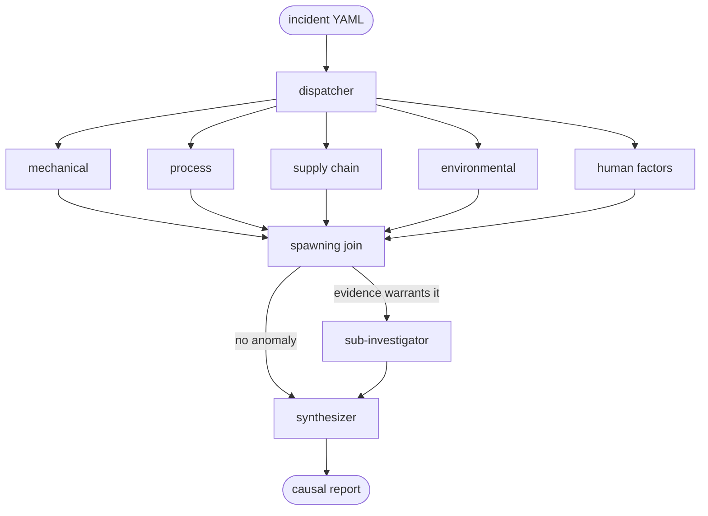

# ExpertView

[](https://github.com/dlion7002/ExpertView/actions/workflows/ci.yml)

**Multi-agent Root Cause Analysis for industrial manufacturing incidents.** Five domain investigators run in parallel as LangGraph branches over domain-specific RAG stores, spawn a sub-investigation when the evidence warrants one, and converge on an evidence-weighted causal report with citations back to source documents.

Built on LangGraph + LangSmith, with every LLM call routed through a single OpenRouter gateway and embeddings running locally.

---

## The problem

Root cause analysis is slow because it is sequential. A machine fault gets checked by the maintenance team, findings pass to process engineering, which passes to supply chain. Each handoff costs days, and the full picture is often never assembled — so the same root causes recur.

The structural issue is that you do not know ex ante which domain holds the root cause. Investigating mechanical first when the answer is a supplier batch change is not slow because of bad tooling; it is slow because the shape is wrong. RCA needs parallel hypothesis pursuit across knowledge bases that cannot share a context window, followed by convergence to a weighted explanation.

That is the shape ExpertView implements.

## How it runs



The dispatcher fans out to all five investigators at once. Each one retrieves from **its own vector store** — mechanical reads FMEAs, maintenance logs and torque specs; supply chain reads vendor qualifications, batch traceability and receiving QA; human factors reads shift handovers, training matrices and SOPs. No investigator sees another's corpus.

Investigators write `Finding` objects into the LangGraph shared state and never call each other. At the join, a predicate inspects the accumulated findings and decides whether to **spawn a sub-investigation** — for example, a mechanical finding about a bearing anomaly triggers a targeted pass over the supplier's batch history. The depth of the tree is not known when the run starts.

The synthesizer is the sole reader of the final state. It runs two passes: a draft causal report, then a reasoning narrative grounded in **deterministic scores computed in code, not by the model**. Hypothesis confidence is re-scored from evidence weight and cross-domain corroboration (`evidence/convergence.py`) after the LLM drafts, so the ranking a viewer reads is arithmetic, not vibes.

## What is engineered here

| Concern | Where it lives | What it does |
|---|---|---|
| Parallel fan-out | `orchestration/runner.py` | Five investigator branches under one `asyncio.Semaphore(5)`; verified against a wall-time budget in `tests/integration/test_parallel_fanout.py` |
| Dynamic spawning | `agents/spawning.py` | Conditional edge on accumulated evidence, with an explicit join node so the branch order is deterministic |
| Evidence-weighted convergence | `evidence/convergence.py` | Pure functions: per-finding weight, cross-domain corroboration, blended re-scoring of LLM-drafted hypotheses |
| Domain RAG | `rag/` | `KnowledgeStore` protocol over LangChain `InMemoryVectorStore`; per-domain indices cached on disk, keyed by embedding model |
| LLM resilience | `agents/llms.py` | Bounded retry with exponential backoff + jitter on 429/5xx, `Retry-After` honored, immediate re-raise on other 4xx; deterministic synthesizer seed |
| Observability | LangSmith spans + `orchestration/streaming.py` | Every node traced; `ProgressEvent` stream drives live status in both surfaces |
| Offline fallback | `expertview trace-export` / `replay` | Re-renders a captured run through the identical code path — no network, no model load |
| Prompt versioning | `prompts/` | Every investigator and synthesizer prompt is a versioned file, never inlined in agent code |

Cross-agent data is Pydantic v2 throughout (`Finding`, `Hypothesis`, `CausalLink`, `CausalReport`, `Incident`, `Document`) — no raw dicts cross a module boundary. Module boundaries are enforced as walls: `rag/` does not import from `agents/`, `evidence/` does not import from `orchestration/`.

## Quickstart

Requires Python 3.11+ and [`uv`](https://docs.astral.sh/uv/).

```powershell
uv sync
Copy-Item .env.example .env    # then set OPENROUTER_API_KEY
```

Run the investigation from the CLI:

```powershell
uv run python -m expertview.cli demo --incident data/incidents/cnc_out_of_tolerance.yaml --live
```

`--live` streams investigator status as the graph runs. Without it, the run blocks and prints only the final report.

Or open the Streamlit surface — the incident panel is editable, so you can change the summary, add a symptom, and re-run to watch the investigators respond:

```powershell
uv run streamlit run src/expertview/ui/app.py
```

Before a run that spends real credit, the pre-flight check verifies env vars, incident YAML parsing, Streamlit imports, the local embedding model, and LangSmith connectivity:

```powershell
uv run python -m expertview.cli doctor
```

Full setup walkthrough and first-run troubleshooting: [ProjectDocs/getting-started.md](ProjectDocs/getting-started.md).

## Configuration

| Variable | Required? | Purpose |
|---|---|---|
| `OPENROUTER_API_KEY` | required | Single gateway key for every LLM call |
| `LANGSMITH_API_KEY` | recommended | Per-node tracing; also unlocks `trace-export` |
| `LANGSMITH_PROJECT` | optional | LangSmith project name. Defaults to `default` |
| `EXPERTVIEW_SYNTH_MODEL` | optional | OpenRouter model ID for the synthesizer |

Investigators run on `openrouter/owl-alpha` and the synthesizer defaults to `deepseek/deepseek-v4-flash:free` — both free tier, so the whole system runs at zero cost. Point `EXPERTVIEW_SYNTH_MODEL` at a frontier model to upgrade only the synthesis pass, which is the one whose prose a reader actually judges. Embeddings run locally on `BAAI/bge-small-en-v1.5`; no embedding API calls at all.

## Repository map

```
src/expertview/
  agents/          investigator + synthesizer nodes, spawning predicates, LLM factory
  evidence/        Pydantic cross-agent models, convergence scoring
  orchestration/   LangGraph state, graph wiring, progress streaming
  prompts/         versioned prompt files (never inlined in code)
  rag/             KnowledgeStore protocol, per-domain vector stores, disk cache
  ui/              Streamlit demo surface
  cli.py           demo / trace-export / replay / doctor
data/
  domains/         mock corpora, one folder per investigator domain
  incidents/       incident scenarios as YAML
tests/
  unit/            141 offline tests
  integration/     graph-level tests; the three live-API tests skip without a key
ProjectDocs/       vision, architecture, decision log
```

## Quality gates

```powershell
uv run pytest                  # 148 passed, 3 skipped without API keys
uv run ruff check .
uv run ruff format --check .
```

All three run on every pull request via [GitHub Actions](.github/workflows/ci.yml). The three skipped tests are the ones that make live OpenRouter calls; everything else, including the full graph run with dynamic spawning, is covered offline with scripted fakes.

## Documentation

- [ProjectDocs/project_introduction.md](ProjectDocs/project_introduction.md) — the problem, and why it genuinely requires a multi-agent architecture.
- [ProjectDocs/architecture.md](ProjectDocs/architecture.md) — module map, protocols, data flow, concurrency model.
- [ProjectDocs/vision.md](ProjectDocs/vision.md) — intent, users, success criteria, non-goals.
- [ProjectDocs/decisions.md](ProjectDocs/decisions.md) — every locked decision with its reasoning, alternatives considered, and reversibility cost.
- [ProjectDocs/getting-started.md](ProjectDocs/getting-started.md) — install, configure, run, troubleshoot.
- [CONTRIBUTING.md](CONTRIBUTING.md) — branching and review conventions.
- [CLAUDE.md](CLAUDE.md) / [AGENTS.md](AGENTS.md) — the operating contract this repo hands to coding agents: hard rules, architecture invariants, and the decision-logging loop the build followed.

## Scope

ExpertView is one concrete application, not a framework. The mock corpora under `data/domains/` are authored fixtures with a planted causal chain, not real plant data. The modular boundaries exist as engineering discipline, not as a public API — nothing here is packaged for reuse as a library.
